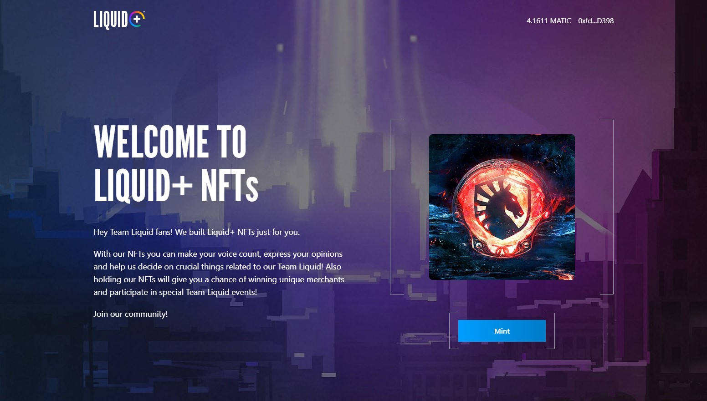

# Liquid+ NFTs DAO

Dapp is deployed on:\
https://liquid-dao-nfts.vercel.app/

Application is deployed on Polygon Mumbai Testnet.

NFT collection contract address:\
https://mumbai.polygonscan.com/address/0x63B7eeaD4d9F0c99e1F8Bd2D4763c61B6acee5f3

DAO contract address:\
https://mumbai.polygonscan.com/address/0x053928BfA9B158a707F76A4Cd1c710bAFC29f037

-----

### If you wanna try this app you will need MetaMask wallet:
1. Install metamask as an extension to your browser: https://metamask.io/
2. Create your wallet account (save your seed phrase)

3. You need to be connected to Polygon Mumbai Testnet, so add Polygon network manually or vist:
    - https://chainlist.org/
    - on the list of chains find Polygon Mumbai
    - connect wallet
    - and add Polygon Mumbai network
4. You will also need some testnet MATIC tokens to pay for transaction fees:
    - copy your wallet address
    - visit https://mumbaifaucet.com/
    - you can paste there your address and send request for MATIC tokens
    - wait few seconds and tokens should be in your wallet
5. Now that you have some MATIC on your wallet, you good to go!

----

